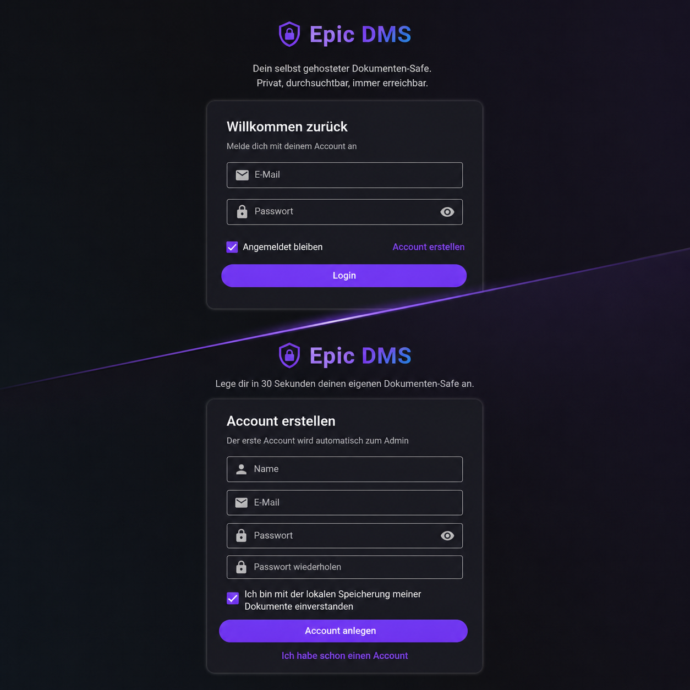
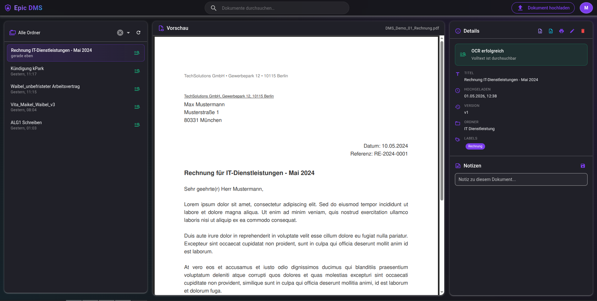
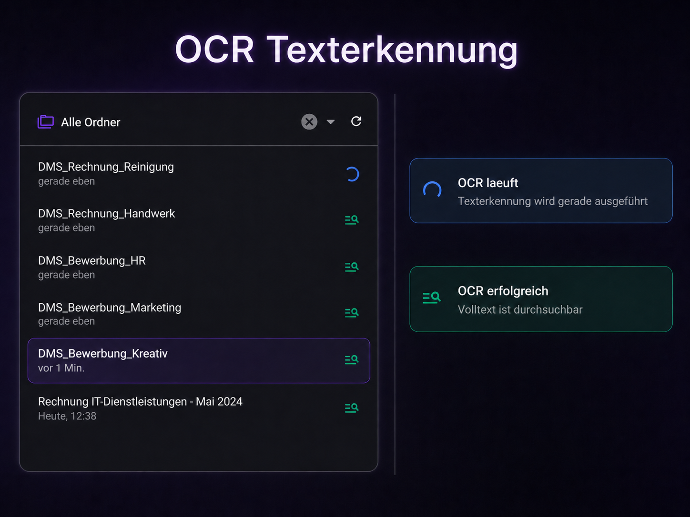

# Epic DMS

Selbst gehostetes **Dokumenten-Management-System** mit OCR-Volltextsuche, Versionierung, Checkout/Checkin und Multi-User-Auth. Privat, einfach, schnell aufgesetzt — gedacht fuer kleine Haushalte oder Teams, die ihre Belege, Vertraege und PDFs an einer Stelle bündeln und durchsuchbar machen wollen, ohne sie einer Cloud anzuvertrauen.

> Lade ein PDF hoch, das System erkennt den Text (OCR) im Hintergrund und macht ihn durchsuchbar — inklusive Eigennamen, Beträgen und allem, was im Dokument steht.

---

## Screenshots

> Hinweis: Die Bilder werden ergaenzt sobald die Live-Demo eingerichtet ist (siehe `docs/screenshots/README.md`).

| Login | Hauptansicht |
|---|---|
|  |  |

| Upload | OCR-Status |
|---|---|
|  |  |

---

## Features

- **PDF-Upload** mit Multipart, Datei-Limit 20 MB, MIME-Type-Validierung
- **Automatische OCR (Texterkennung)** via `ocrmypdf` mit deutscher Sprach-Datei
- **Volltextsuche** ueber Titel, Labels und OCR-Text mit AND/NOT-Operatoren
  - Beispiel: `Rechnung Steam -Amazon` findet alle Rechnungen von Steam, ausser sie erwaehnen Amazon
- **Labels und Ordner** zur Organisation, mit Auto-Vorschlaegen aus bestehenden Werten
- **Versionierung** mit Checkout/Checkin — verhindert paralleles Bearbeiten desselben Dokuments
- **Notizen** pro Dokument
- **Async-Job-Queue** (BullMQ + Redis) fuer OCR — Upload-Request kommt sofort zurueck, Status wird live gepollt
- **Multi-User** mit JWT-Auth und Rollen (`admin`, `member`)
- **HTTP-Security** out-of-the-box: Helmet, Rate-Limit auf Auth-Routen, CORS-Allowlist
- **Druckansicht** direkt im Browser

---

## Tech Stack

**Backend** (`dms-backend/`):
- Node.js 20+
- Express 5
- MongoDB 7 (via Mongoose 8)
- BullMQ + Redis 7 (Job-Queue)
- Multer (Datei-Upload)
- bcrypt + jsonwebtoken (Auth)
- helmet + express-rate-limit (Security)

**Frontend** (`dms-frontend/`):
- Quasar 2 / Vue 3
- Pinia (State)
- axios (HTTP)
- vue-i18n (Übersetzungs-Setup vorbereitet)

**Infrastruktur:**
- Podman oder Docker fuer Mongo + Redis (lokal als Container)
- `ocrmypdf` (System-Binary, mit `tesseract` fuer die OCR)

---

## Architektur

```
                          ┌─────────────────┐
                          │     Browser     │
                          └────────┬────────┘
                                   │
                  ┌────────────────┴───────────────┐
                  │   Frontend-Container (nginx)   │
                  │   serviert SPA + /api-Proxy    │
                  └────────────────┬───────────────┘
                                   │ /api/...
                                   ▼
       ┌───────────────┐   ┌────────────────────────┐
       │   MongoDB     │◀──┤   Backend-Container    │
       │ (Documents,   │   │  (Express, JWT, CRUD)  │
       │  Users,       │   └───────────┬────────────┘
       │  Labels)      │               │ enqueue Job
       └───────────────┘               ▼
                                ┌─────────────┐
                                │    Redis    │
                                │   (BullMQ)  │
                                └──────┬──────┘
                                       │ pulls Jobs
                                       ▼
                          ┌────────────────────────┐
                          │   Worker-Container     │
                          │   - ocrmypdf           │
                          │   - schreibt Mongo     │
                          └────────────────────────┘
```

Alle fünf Services orchestriert die `compose.yml`. Mongo und Redis laufen permanent (Default-Profil); Backend, Worker und Frontend sind im `full`-Profil — so kann man im Dev-Modus die App-Code-Container weglassen und Backend/Frontend lokal mit Hot-Reload entwickeln.

Beim Upload:
1. Browser sendet PDF an Backend
2. Backend speichert Datei + legt Document mit `ocr.status: pending` an
3. Backend enqueued OCR-Job in Redis und antwortet sofort (HTTP 202)
4. Worker zieht Job, fuehrt `ocrmypdf` aus, schreibt Text + `status: done` zurueck
5. Browser pollt das Dokument alle 3 Sekunden, Badge wechselt von "pending" → "processing" → "done"

---

## Quick Start

Es gibt zwei Wege:

### Variante A — Komplettes System aus Containern (empfohlen)

Mit **Podman + podman-compose** (oder Docker + docker compose) startet alles per Befehl:

```bash
# 1. Repo klonen
git clone https://github.com/MW-Code/epic-dms.git
cd epic-dms

# 2. .env am Root anlegen + Werte setzen
cp .env.example .env
# In .env: JWT_SECRET, MONGO_INITDB_ROOT_PASSWORD generieren
#   node -e "console.log(require('crypto').randomBytes(48).toString('hex'))"

# 3. Voller Stack: Mongo + Redis + Backend + Worker + Frontend
podman compose --profile full up -d --build
```

→ Frontend offen unter [http://localhost:8080](http://localhost:8080). Erster Registrant wird automatisch Admin.

Logs anschauen:
```bash
podman compose logs -f                  # alle Services
podman compose logs -f backend worker   # nur die App-Container
```

Stoppen: `podman compose --profile full down`. Daten bleiben im Volume `dms-backend/docker-data/` persistent erhalten.

### Variante B — Backend lokal, Infra in Containern (Dev-Modus)

Schneller iteriert mit Hot-Reload. Voraussetzung: `Node 20+`, `ocrmypdf` und `tesseract-langpack-deu` installiert.

```bash
git clone https://github.com/MW-Code/epic-dms.git
cd epic-dms

# Top-Level .env (Mongo/Redis-Credentials)
cp .env.example .env

# Nur Mongo + Redis (Default-Profil) starten
podman compose up -d

# Backend-Setup
cd dms-backend
cp .env.example .env
npm install

# Backend in Terminal A
npm start
# Worker in Terminal B
npm run worker

# Frontend in Terminal C
cd ../dms-frontend
npm install
npm run dev   # http://localhost:9000
```

System-Deps fuer OCR:
```bash
sudo dnf install -y ocrmypdf tesseract-langpack-deu
```

---

## Detaillierte Installation

### Voraussetzungen

| Tool | Version | Pruefen |
|---|---|---|
| Node.js | 20 oder neuer | `node --version` |
| npm | 10+ | `npm --version` |
| Podman | 4+ (oder Docker) | `podman --version` |
| ocrmypdf | 16+ | `ocrmypdf --version` |
| Tesseract | mit `deu`-Sprachdatei | `tesseract --list-langs` zeigt `deu` |

#### Node installieren (falls fehlt)

Auf Fedora ueber `dnf`:
```bash
sudo dnf install -y nodejs npm
```

Sauberer fuer Entwickler-Maschinen ist [`fnm`](https://github.com/Schniz/fnm) oder `nvm`, weil mehrere Node-Versionen parallel nebeneinander gehalten werden koennen:
```bash
# fnm
curl -fsSL https://fnm.vercel.app/install | bash
fnm install 22
fnm use 22
```

#### OCR-System-Pakete

```bash
sudo dnf install -y ocrmypdf tesseract-langpack-deu
ocrmypdf --version              # sollte 16.x oder hoeher melden
tesseract --list-langs | grep deu
```

Auf Debian/Ubuntu analog mit `apt install ocrmypdf tesseract-ocr-deu`.

### Backend einrichten

```bash
cd dms-backend
cp .env.example .env
```

`.env` oeffnen und folgendes setzen:

```dotenv
PORT=3000

# Lange Random-Zeichenkette generieren:
#   node -e "console.log(require('crypto').randomBytes(48).toString('hex'))"
JWT_SECRET=<dein-generiertes-secret>

# MONGO_INITDB_ROOT_PASSWORD und MONGO_URI muessen das GLEICHE Passwort enthalten.
# WICHTIG: keine Sonderzeichen wie ! " ^ verwenden — die machen sowohl in der
# Shell als auch in URLs Probleme. Empfohlen ist URL-safes Base64:
#   node -e "console.log(require('crypto').randomBytes(24).toString('base64url'))"
MONGO_INITDB_ROOT_USERNAME=dmsroot
MONGO_INITDB_ROOT_PASSWORD=<dein-generiertes-passwort>
MONGO_URI=mongodb://dmsroot:<dein-generiertes-passwort>@localhost:27017/dms?authSource=admin

FRONTEND_ORIGIN=http://localhost:9000
UPLOAD_DIR=./uploads

REDIS_URL=redis://127.0.0.1:6379
OCR_CONCURRENCY=2
```

Dann Dependencies installieren:
```bash
npm install
```

### MongoDB-Container starten

Aus dem `dms-backend/`-Verzeichnis (`.env` muss gesetzt sein):

```bash
set -a && source .env && set +a
mkdir -p docker-data/mongo
podman run -d \
  --name dms-mongo \
  --restart unless-stopped \
  -p 127.0.0.1:27017:27017 \
  -e MONGO_INITDB_ROOT_USERNAME="$MONGO_INITDB_ROOT_USERNAME" \
  -e MONGO_INITDB_ROOT_PASSWORD="$MONGO_INITDB_ROOT_PASSWORD" \
  -v "$(pwd)/docker-data/mongo:/data/db:Z" \
  docker.io/library/mongo:7
```

Auth-Test (sollte `dmsroot/admin/root` zeigen):
```bash
podman exec dms-mongo mongosh --quiet \
  -u "$MONGO_INITDB_ROOT_USERNAME" \
  -p "$MONGO_INITDB_ROOT_PASSWORD" \
  --authenticationDatabase admin \
  --eval "db.getSiblingDB('admin').runCommand({connectionStatus:1}).authInfo"
```

### Redis-Container starten

```bash
podman run -d \
  --name dms-redis \
  --restart unless-stopped \
  -p 127.0.0.1:6379:6379 \
  docker.io/library/redis:7-alpine

podman exec dms-redis redis-cli ping       # → PONG
```

### Backend starten

Drei Terminals:

**Terminal A — API-Server**
```bash
cd dms-backend
npm start
# Erwartet:
#   MongoDB verbunden
#   Server läuft auf http://localhost:3000
```

**Terminal B — OCR-Worker**
```bash
cd dms-backend
npm run worker
# Erwartet:
#   MongoDB verbunden
#   OCR-Worker bereit (concurrency=2)
```

**Terminal C — Frontend**
```bash
cd dms-frontend
npm install
npm run dev
# Browser oeffnet sich auf http://localhost:9000
```

Der **erste Registrant** wird automatisch zum Admin (`role: admin`), alle weiteren sind `member`.

---

## Bedienung

**Dokument hochladen**
- Topbar: "Dokument hochladen" → PDF auswaehlen → optional Titel, Labels und Ordner setzen
- Datei wird sofort gespeichert, OCR laeuft im Hintergrund (Status-Banner zeigt Fortschritt)

**Volltextsuche**
- Suchfeld in der Topbar — sucht in Titel, Labels und OCR-Text
- Operatoren:
  - `Rechnung Steam` — beide Begriffe muessen vorkommen (AND)
  - `Rechnung -Amazon` — Amazon darf nirgends vorkommen
- Suche ist case-insensitive und greift auch bei Substrings ("Waib" findet "Waibel")

**Versionierung (Checkout/Checkin)**
- Beim Upload-Button in der Detail-Spalte wird das aktuell ausgewaehlte Dokument durch eine neue PDF-Version ersetzt
- Vorgaengerversion wandert in `history`, Versionsnummer wird hochgezaehlt
- Optionaler Checkout-Endpoint sperrt das Dokument fuer andere User waehrend der Bearbeitung

**Labels & Ordner**
- Labels: Mehrere pro Dokument, im Edit-Dialog freitextlich oder aus Vorschlaegen
- Ordner: genau einer pro Dokument, optional, ebenfalls freitextlich
- Filter in der Sidebar (Dropdown) zeigt nur Dokumente eines Ordners

---

## Konfiguration

Alle Werte werden in `dms-backend/.env` gesetzt (`.env.example` als Vorlage).

| Variable | Pflicht | Default | Bedeutung |
|---|---|---|---|
| `PORT` | nein | `3000` | Port des Express-Servers |
| `JWT_SECRET` | **ja** | — | Signing-Secret fuer JWT, lange Random-Zeichenkette |
| `MONGO_URI` | **ja** | — | Mongo-Verbindungsstring inkl. Credentials |
| `MONGO_INITDB_ROOT_USERNAME` | nein* | — | Wird vom Mongo-Container beim ersten Start gelesen |
| `MONGO_INITDB_ROOT_PASSWORD` | nein* | — | Analog |
| `FRONTEND_ORIGIN` | nein | `http://localhost:9000` | CORS-Allowlist |
| `UPLOAD_DIR` | nein | `./uploads` | Wo Uploads zwischengelagert werden |
| `REDIS_URL` | **ja** | — | Verbindungsstring fuer BullMQ |
| `OCR_CONCURRENCY` | nein | `2` | Wieviele OCR-Jobs parallel verarbeitet werden |

*) Die `MONGO_INITDB_*`-Variablen werden vom `podman run`-Befehl benoetigt, nicht vom Backend-Code.

Das Frontend liest `dms-frontend/.env`:

| Variable | Default | Bedeutung |
|---|---|---|
| `API_URL` | `http://localhost:3000/api` | Wohin die App ihre HTTP-Calls schickt. In Production hinter nginx-Proxy: `/api` |

---

## Troubleshooting

| Symptom | Ursache + Fix |
|---|---|
| `JWT_SECRET fehlt` beim Start | `.env` nicht angelegt oder Variable leer — siehe Konfiguration |
| `MongoServerError: Authentication failed` | `MONGO_URI` und `MONGO_INITDB_ROOT_PASSWORD` muessen das GLEICHE Passwort enthalten. Wenn Passwort in der `.env` geaendert wurde: Container + Volume neu erzeugen, weil Mongo das Passwort beim ersten Start einbrennt |
| `Permission denied` beim Loeschen von `docker-data/mongo` | rootless Podman-UID-Mapping — `podman unshare rm -rf docker-data/mongo` benutzen |
| `spawn ocrmypdf ENOENT` | `ocrmypdf` nicht installiert oder nicht im PATH — `which ocrmypdf` pruefen |
| Upload-Status bleibt fuer immer "pending" | Worker laeuft nicht — separates Terminal: `npm run worker` |
| Suche findet nichts trotz vorhandenem Wort | OCR-Status pruefen — wenn `error`, ocrmypdf-Logs im Worker-Terminal anschauen |
| 429-Fehler beim Login | Rate-Limit greift (10 Versuche / 15 min / IP) — kurz warten oder Limit in `server.js` anpassen |

---

## Bekannte Limitationen

- **Token im localStorage** — anfaellig fuer XSS. Fuer Portfolio-Setup vertretbar, in Produktion sollte httpOnly-Cookie verwendet werden
- **Uploads im lokalen Filesystem** — bei Deployment auf mehrere Server faellt das auseinander. Object-Storage (MinIO/S3) steht auf der Roadmap
- **Kein E-Mail-Versand** — Passwort vergessen / Account-Verifizierung gibt es nicht
- **Keine Tests** — kommt
- **Volltextsuche ist Regex-basiert** — fuer kleine bis mittelgrosse Datenmengen (< 10k Dokumente) voellig ausreichend, fuer mehr waere ein Mongo-Text-Index oder MeiliSearch besser

---

## Roadmap

- [ ] **Compose-Stack** — `podman-compose up` startet Backend + Worker + Mongo + Redis als ein Befehl
- [ ] **Object Storage** — MinIO statt lokales Filesystem
- [ ] **Cleanup unbenutzter Labels** — leere Label-Vorschlaege automatisch aufraeumen
- [ ] **httpOnly-Cookie-Auth** statt localStorage-Token
- [ ] **Test-Suite** (Vitest fuer Backend, Cypress fuer Frontend)
- [ ] **Passwort-Reset per E-Mail**
- [ ] **Audit-Log** fuer Admin-Aktionen
- [ ] **Mobile-Responsive Layout** — aktuell auf Desktop optimiert

---

## Lizenz

[MIT](LICENSE) — frei nutzen, modifizieren, weiterverteilen.

---

## Built with Claude Code

Dieses Projekt wurde mit Unterstuetzung von [Claude Code](https://www.anthropic.com/claude-code) (Anthropic) entwickelt — Architektur-Entscheidungen, Code-Reviews, Skalierungs-Refactorings und diese Dokumentation entstanden in Pair-Programming-Sessions.
